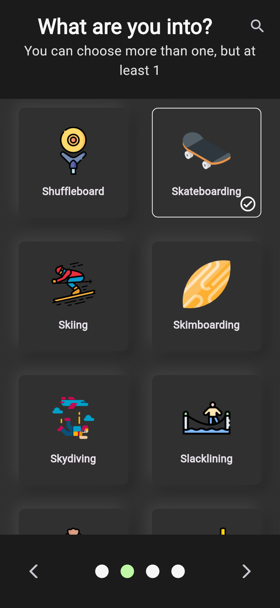
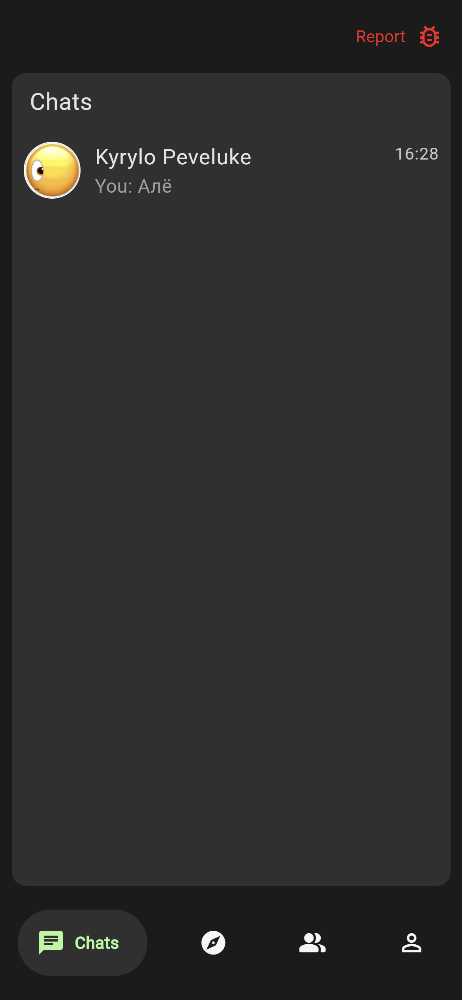

**LinkUp** is a social network web app that connects people with common hobbies and interests. Users choose their hobbies from a list of more than **400 hobbies**, get recommendations, and find like-minded people.

The main focus is on **privacy and security**: all personal messages are encrypted, and private keys are stored locally on the device and can be restored via a seed phrase, similar to crypto wallets.

---

## Security and Cryptography

LinkUp uses modern cryptographic standards:

- **X25519** — to generate a shared symmetric key between two users;
- **Ed25519** — for digital signature and verification of messages;
- **BIP-39** — for seed phrase generation and deterministic key generation;
- All data can be restored using a seed phrase (similar to crypto wallets).

### More details

1. **Keys generation**:
    
    - The user receives a `seed phrase` upon registration.
        
    - From it, key pairs `Ed25519` and `X25519` are generated.
        
2. **Sending a message**:
    
    - The message is signed with the private key `Ed25519`.
        
    - The shared key of two users in a chat is obtained via `X25519` (Diffie–Hellman). The key is stored on the device of each individual user.
        
    - The message is encrypted with `AES-256-GCM`.
        
3. **Getting messages**:
    
    - The receiver decrypts the message with the shared key.
        
    - Verifies the signature via the sender's public `Ed25519` key.
        
    - If the message could not be verified, an exclamation mark is displayed next to the message.

---

## 🏗️ Architecture

- **Frontend**: Flutter (Android, iOS, Web)  

- **Local Backend (services running alongside the app)**:
  - **Dart** — recommendation system (hobby-based), cryptography utilities (encryption/decryption, seed phrase recovery)
  - **Node.js** — cryptographic implementation for web app

- **Storage & Infrastructure**:  
  - **Firebase** — Authentication, Firestore, Realtime Database, Cloud Messaging, Hosting, App Check  
  - **Supabase** — Object storage (profile pictures)

---

## 🔗 Other programs integrated into the project

- [JWT Verification Service](https://github.com/printHelloworldd/jwt_verification)  
    Microservice for verifying JWT tokens obtained from Firebase Authentication ID token. Used to verify user authenticity before sending notifications.
    
- [Dart Push Notification Service](https://github.com/printHelloworldd/fcm_service)  
    A microservice responsible for sending push notifications via Firebase Cloud Messaging (FCM), integrated with this project.
	
- [Zap Hobby API](https://github.com/printHelloworldd/zap-hobby-api)  
    A Spring Boot backend program that returns a list of hobbies. Used in the application to generate a profile and personalized recommendations.
	
- [Flutter Node Worker](https://pub.dev/packages/flutter_node_worker) 
    During development of LinkUp, I created a custom **Dart package** that provides a simple API for working with **Web Workers**.  
	It allows offloading heavy cryptographic operations (encryption, decryption, key generation) to background threads in the **Web version** of the app, ensuring smooth UI performance.
	This package can be reused in other projects where computationally expensive operations should not block the main UI thread.

---

## 🖼️ Screenshots

---

## What's next
- Adaptation for Android and iOS (releases in Google Play and App Store)
- Interface localization
- Implement passwordless authorization
- Change of theme
- Group chats and communities
- Deep links
- Spam filter
- Add a profession dataset and update the recommendation system to take into account the user's profession

---

## 🧑‍💻 Contribution to the project

Contribution to the development of the project is welcome!
If you want to make changes:

1. Fork the repository;
    
2. Create a branch named `feature/feature-name`;
    
3. Make your changes;
    
4. Open a Pull Request.
    

I recommend discussing the idea via Issues beforehand.

---
